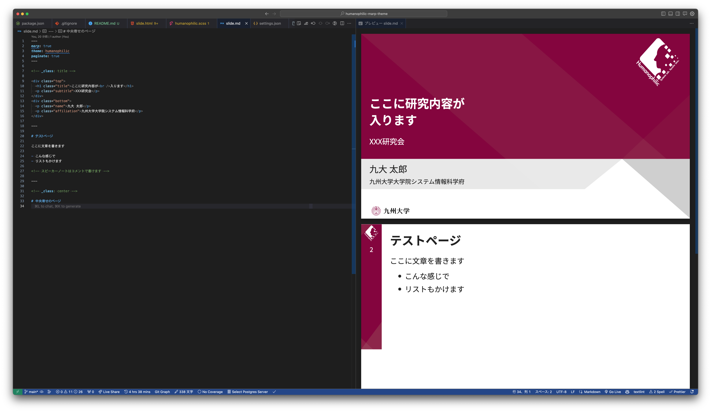

# Humanophilic Marp Theme

学会発表用のスライドテーマです。[Marp](https://marp.app/)を使ってスライドを作成する際に利用できます。

## 環境構築

```sh
npm ci
```

以下のコマンドでスライドのプレビューを確認することができます

```sh
npm run presentation
```

また、以下のコマンドでPDF・PPTXを出力することができます

```sh
npm run export
```

vscodeの場合は、[Marp for VS Code](https://marketplace.cursorapi.com/items?itemName=marp-team.marp-vscode)をインストールすることで、簡単にプレビューを確認することができます。



## スライドの作り方

`slide.md`にスライドの内容を以下のようなフォーマットで記述します。区切り線（`---`）でページを区切ります。また、marpの独自記法が沢山あるので、[Marp Basic Example](https://speakerdeck.com/yhatt/marp-basic-example)を読んでおくことをおすすめします。

```md
---
marp: true
theme: humanophilic
paginate: true
---

# 1ページ目

<!-- 1ページ目のスピーカーノートを書くことができます -->

---

# ２ページ目

```

## スライドのテンプレート

`themes/humanophilic.scss`の中でスライドのテンプレートを定義しています。mdには`_class`を使ってテンプレートを指定します。また、以下のように新規のテンプレートを追加することもできます。

```scss
section {
  &.テンプレート名 {
    // テンプレートのスタイルを記述
  }
}
```

```md
<!-- _class: テンプレート名 -->
```

### タイトルページ


```md
<!-- _class: title -->

<div class="top">
  <h1 class="title">ここに研究内容が<br />入ります</h1>
  <p class="subtitle">XXX研究会</p>
</div>
<div class="bottom">
  <p class="name">九大 太郎</p>
  <p class="affiliation">九州大学大学院システム情報科学府</p>
</div>
```

### メインページ


```md
# テストページ

ここに文章を書きます

- こんな感じで
- リストもかけます
```

### 中央寄せページ


```md
<!-- _class: center -->

# 中央寄せのページ
```

## テーマのカスタマイズ

theme/humanophilic.scssを編集することでテーマをカスタマイズすることができます。テーマを修正した場合は、以下のコマンドでcssを出力する必要があります。

```sh
npm run build
```

また、新規でテーマを作成する場合は、新規のscssファイルを作成し、`themes`ディレクトリに配置してください。また、Marp for VSCodeを使っている場合は、`settings.json`にcssのパスを記述する必要があります。

## 参考資料

- [Marp公式サイト](https://marp.app/)
- [Marp Basic Example](https://speakerdeck.com/yhatt/marp-basic-example)
- [Marp for VS Code](https://marketplace.cursorapi.com/items?itemName=marp-team.marp-vscode)
- [Marp Core built-in themes](https://github.com/marp-team/marp-core/tree/main/themes#metadata-for-additional-features)
- [Marpit Markdown](https://marpit.marp.app/markdown)
